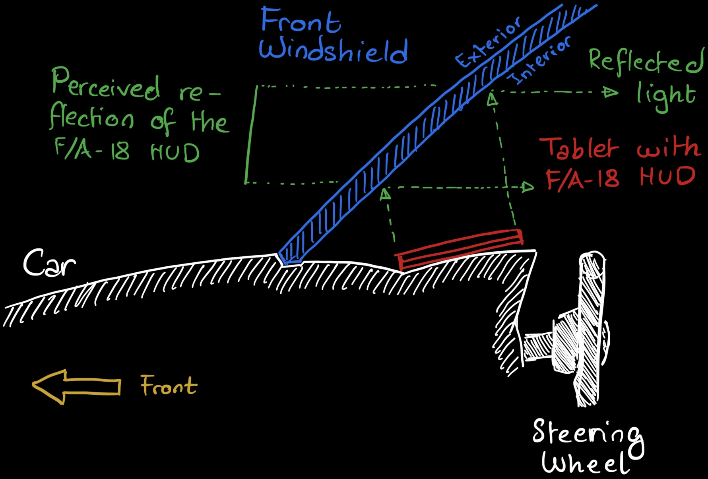
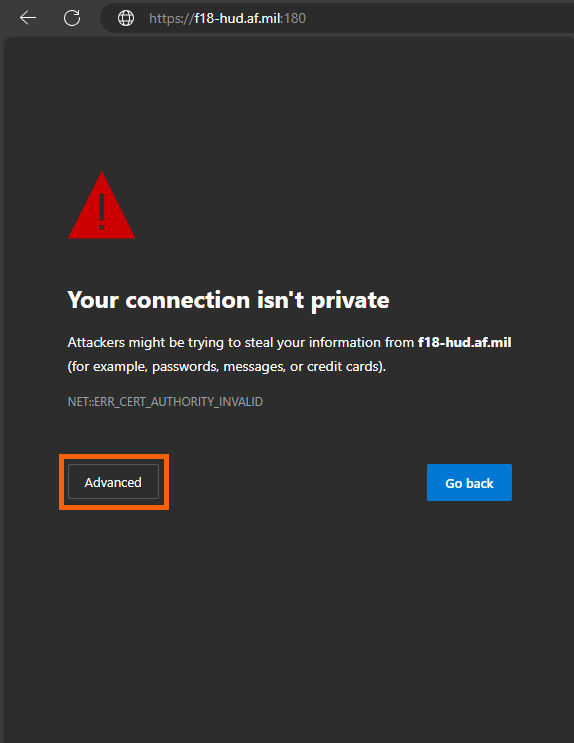
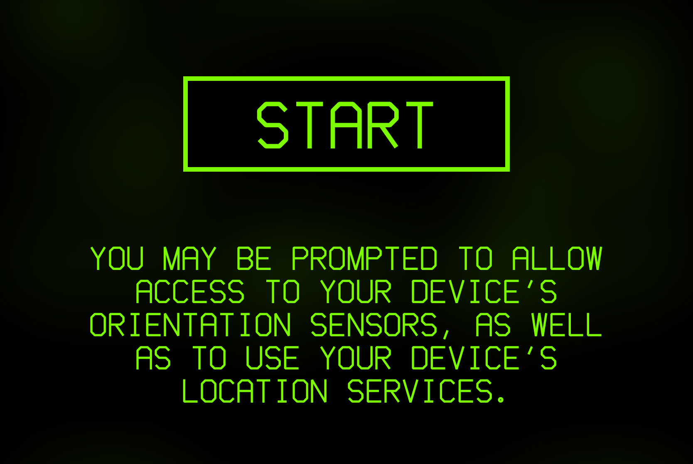
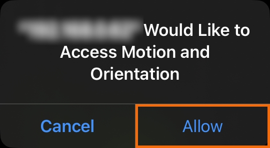
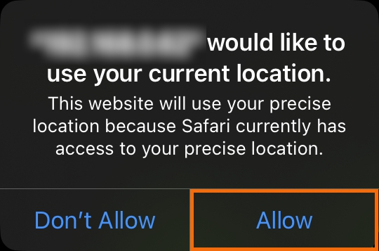
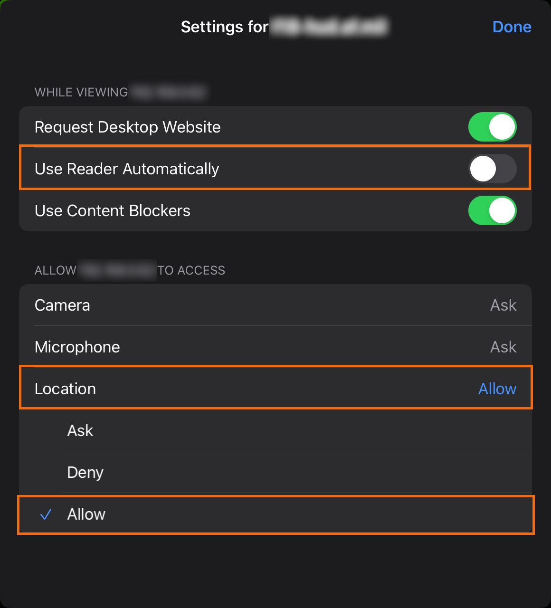
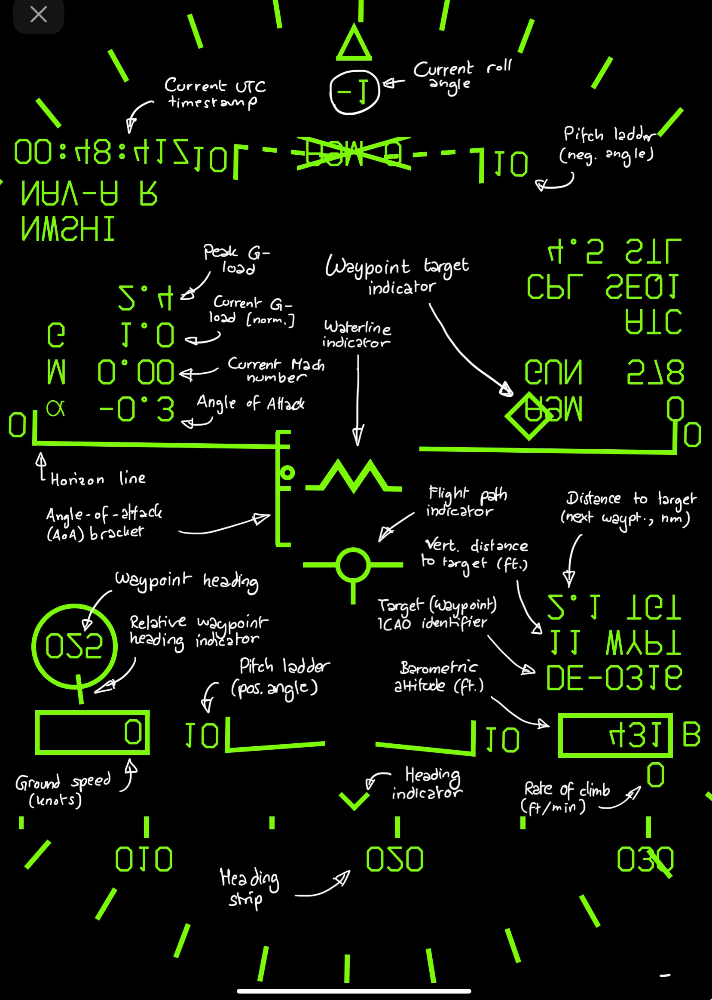

> [!CAUTION]
> ${\color{red}\textsf{Respect local traffic laws and maintain situational awareness at all times while driving!}}$
> ${\color{red}\textsf{Neither this repository, the repository owners, or code contributors are responsible or}}$
> ${\color{red}\textsf{liable in any way for any accidents or damages (legal or physical) which occurred whilst}}$
> ${\color{red}\textsf{using this project.}}$

Table of contents:
- [Introduction](#_intro)
- [Installation](#_install)
- [First Steps](#_first_steps)
- [Usage](#_usage)


## <a name="_intro"></a>
# F/A-18 HUD
This project is a minimalistic webpage replicating the head-up display (HUD) of an [McDonnell Douglas F/A-18 Hornet fighter jet](https://en.wikipedia.org/wiki/McDonnell_Douglas_F/A-18_Hornet).
It is intended to be shown in full-screen mode on an Android- or iOS-Tablet, which is placed under a car's windscreen, in order to simulate the experience of sitting in an F/A-18 whilst driving:




## <a name="_install"></a>
# Installation
You may deploy this web app with or without using Docker.

## Installation using Docker
1. [Download/install Docker](https://www.docker.com/get-started/).
2. Clone this repository using `git clone https://github.com/Unknown6656/F18-HUD`.
3. Run the command `docker compose build`.
4. Run the web server using `docker compose up`.

## Installation without Docker
1. Install python.
2. Install [Flask](https://flask.palletsprojects.com/en/3.0.x/) using `pip install flask`.
3. Clone this repository using `git clone https://github.com/Unknown6656/F18-HUD`.
4. Run the web server using `python server.py`.

This will open a HTTPS web server listening at `0.0.0.0:180`. The usage of a web server is only necessary for serving all web resources using HTTPS, which is required by mobile browsers when using the tablet's sensors, such as GPS, the gyroscope, magentometer, or accelerometer.

> [!IMPORTANT]
> This HUD has been optimized for the [2018 Apple iPad Pro 11" (3<sup>rd</sup> Generation)](https://support.apple.com/en-us/111897). The behaviour of the HUD may therefore vary on other devices.
>
> To change this, please modify the stylesheet `css/main.css` accordingly.


## Re-building the list of ICAO airports
To (re-)build the list of known ICAO airports and waypoints, you may use one of the following methods:

1. **Our Airports**\
    The list of ICAO airports is built by grabbing a CSV table from https://ourairports.com/ and and converting it. In order to re-build the list, run the following command:
    ```bash
    python tools/icao-airport-ourairports.py
    ```
2. **SkyVector**\
    The list of ICAO airports is built by crawling through https://skyvector.com/ and parsing the individual pages. In order to re-build the list, run the following command:
    ```bash
    python tools/icao-airport-skyvector.py
    ```

> [!NOTE]
> Note that the second method will take a _very_ long time, as SkyVector is not the fastest site to crawl.
> Furthermore, SkyVector does not seem to have as many airports as OurAirports.

Independent of the method used, the list of airports will be written to `js/airports.js`.


## <a name="_first_steps"></a>
# First post-installation steps
In order to use the F-18 HUD, please follow these steps:

1. Navigate to `https://<ip-address>:180/` on your iPad or mobile tablet.
2. You _may_ be asked to accept the invalid TLS/SSL certificate:<br/>
    Chrome:<br/>
    
    <br/>
    Mobile Safari:<br/>
    
3. Start the HUD by clicking the `START`-button:<br/>
    
4. Allow access to your device's sensors and location services:<br/>
    
    
5. Modify the website settings to always allow access to the device's location services:<br/>
    

You're now set up to use the F/A-18 HUD in your car.


## <a name="_usage"></a>
# Usage
The following image represents the general layout of the F/A-18 HUD:

\
_Please note that the iamge is mirrored along the vertical, as well as the horizontal axis. This is required for the correct display of the HUD in the car's windscreen._


## (TODO : explain the individual components, their function, and deviation from regular behaviour)
- click on nav compass: switch pitch ladder increments
- click on waterline indicator: fullscreen
- click on g-load: reset peak
- click on nav mode: change A/R/L