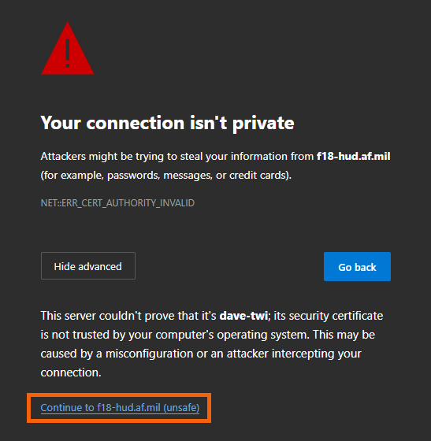
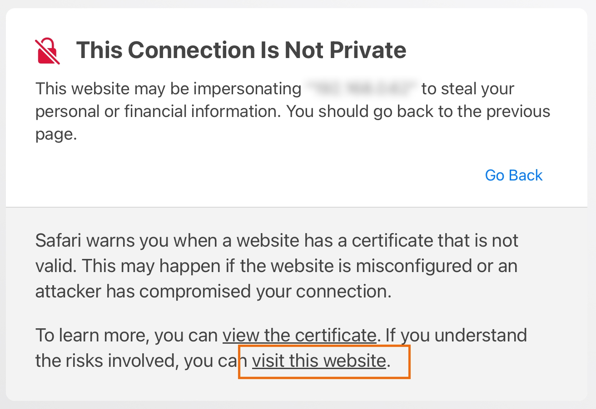

> [!CAUTION]
> ### Respect local traffic laws and maintain situational awareness at all times while driving! Neither this repository, the repository owners, or code contributors are responsible or liable in any way for any accidents or damages (legal or physical) which occurred whilst using this project.

# F/A-18 HUD
This project is a minimalistic webpage replicating the head-up display (HUD) of an [McDonnell Douglas F/A-18 Hornet fighter jet](https://en.wikipedia.org/wiki/McDonnell_Douglas_F/A-18_Hornet).
It is intended to be shown in full-screen mode on an Android- or iOS-Tablet, which is placed under a car's windscreen, in order to simulate the experience of sitting in an F/A-18 whilst driving:

# Installation
1. Clone this repository using `git clone https://github.com/Unknown6656/F18-HUD`
2. Install python.
3. Install [Flask](https://flask.palletsprojects.com/en/3.0.x/) using `pip install flask`
4. Run the web server using `python server.py`.

This will open a HTTPS web server listening at `0.0.0.0:180`. The usage of a web server is only necessary for serving all web resources using HTTPS, which is required by mobile browsers when using the tablet's sensors, such as GPS, the gyroscope, magentometer, or accelerometer.

> [!IMPORTANT]
> This HUD has been optimized for the [2018 Apple iPad Pro 11" (3rd Generation)](https://support.apple.com/en-us/111897). The behaviour of the HUD may therefore vary on other devices.
>
> To change this, please modify the stylesheet `css/main.css` accordingly.

# First post-installation steps
In order to use the F-18 HUD, please follow these steps:

1. Navigate to `https://<ip-address>:180/` on your iPad or mobile tablet.
2. You _may_ be asked to accept the invalid TLS/SSL certificate: 
    Chrome: 
    
     
    Mobile Safari: 
    
3. Start the HUD by clicking the `START`-button: 
    
4. Allow access to your device's sensors and location services: 
    
    
5. Modify the website settings to always allow access to the device's location services: 
    

You're now set up to use the F/A-18 HUD in your car.

# Usage
(TODO)
